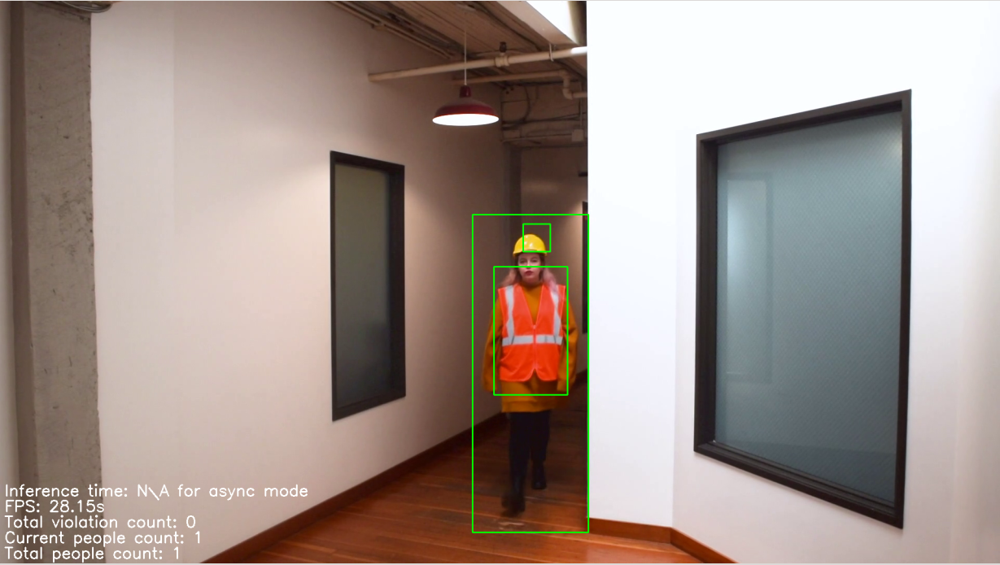
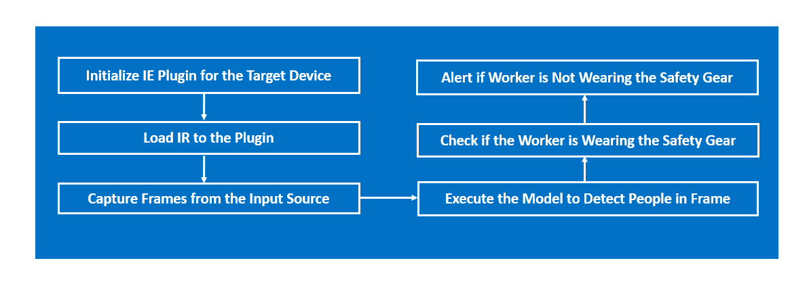
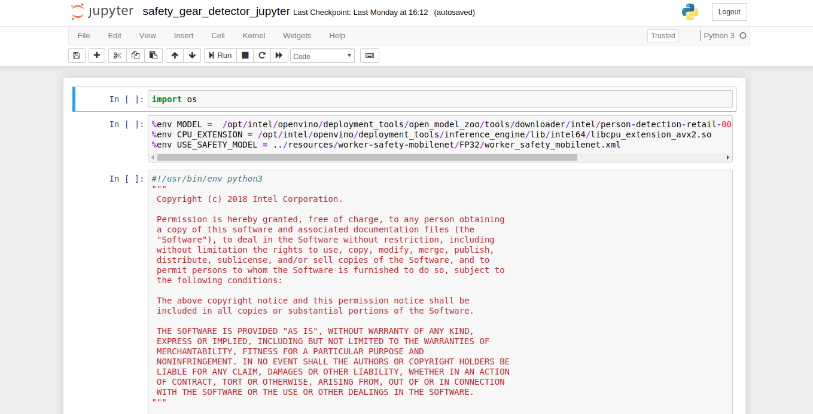

# Safety Gear Detector

| Details           |              |
|-----------------------|---------------|
| Target OS:            |  Ubuntu\* 16.04 LTS   |
| Programming Language: |  Python\* 3.5|
| Time to Complete:    |  30-40min     |



Figure 1: An application capable of detecting people and if they are wearing safety-jackets and hard-hats in a video. 

## What It Does
This application is one of a series of IoT reference implementations illustrating how to develop a working solution for a particular problem. It demonstrates how to create a smart video IoT solution using Intel® hardware and software tools. 
This reference implementation detects people and potential violations of safety-gear standards.

## How It Works
The application uses the Inference Engine included in Intel® Distribution of OpenVINO™ toolkit.

A trained neural network detects people within a designated area. The application checks if each detected person is wearing a safety-jacket and hard-hat. If they are not, a red bounding box is drawn over the person in the video. If they are wearing their designated safety gear, a green bounding box is drawn over them in the video.
   


## Requirements
### Hardware
* 6th to 8th Generation Intel® Core™ processor with Iris® Pro graphics or Intel® HD Graphics

### Software
* [Ubuntu\* 16.04 LTS](http://releases.ubuntu.com/16.04/)

   **Note:** We recommend using a 4.14+ Linux* kernel with this software. Run the following command to determine your kernel version:

   ```
   uname -a
   ```
* OpenCL™ Runtime Package
* Intel® Distribution of OpenVINO™ toolkit 2019 R1 release

## Setup

### Install Intel® Distribution of OpenVINO™ toolkit
Refer to [Install the Intel® Distribution of OpenVINO™ toolkit for Linux*](https://software.intel.com/en-us/articles/OpenVINO-Install-Linux) to install and set up the toolkit.

Install the OpenCL™ Runtime Package to run inference on the GPU. It is not mandatory for CPU inference.

### FFmpeg*
FFmpeg is installed separately from the Ubuntu repositories:
```
sudo apt update
sudo apt install ffmpeg
```

### Install Python* Dependencies
```
sudo apt install python3-pip

sudo pip3 install numpy

sudo pip3 install jupyter
```

## Configure the Application

### Which Model to Use
By default, this application uses the **person-detection-retail-0013** Intel® model, that can be accessed using the **model downloader**. The **model downloader** downloads the __.xml__ and __.bin__ files that will be used by the application.

#### Download the __.xml__ and __.bin__ files

Go to the **model downloader** directory present inside Intel® Distribution of OpenVINO™ toolkit.

  ```
  cd /opt/intel/openvino/deployment_tools/tools/model_downloader
  ```

- Specify which model to download with `--name`.<br><br>

- To optimize the model for FP32, run the following commands:

  ```
  sudo ./downloader.py --name person-detection-retail-0013
  ```
- To optimize the model for FP16, run the following command:
   ```
   sudo ./downloader.py --name person-detection-retail-0013-fp16
   ```
The files will be downloaded inside the Retail/object_detection/pedestrian/rmnet_ssd/0013/dldt directory.  
   
### The Config File
The _resources/conf.txt_ contains the videos that will be used by the application, one video per line.   
Each of the lines in the file is of the form `path/to/video`, e.g.:
```
videos/video1.mp4
```
The `path/to/video` is the path, on the local system, to a video to use as input.

The application can use any number of videos for detection (i.e. the _conf.txt_ file can have any number of lines), but the more videos the application uses in parallel, the more the frame rate of each video scales down. This can be solved by adding more computation power to the machine the application is running on.
   

### Which Input Video to Use
The application works with any input video. We recommend using the [Safety_Full_Hat_and_Vest.mp4](resources/Safety_Full_Hat_and_Vest.mp4) video.   

<!-- This video can be downloaded directly, via the `video_downloader` python script provided. The script works with both python2 and python3. Run the following command:
```
python video_downloader.py
```
The video is automatically downloaded to the `resources/` folder. -->

### Use a Camera Stream
Replace `path/to/video` with the camera ID in conf.txt, where the ID is taken from your video device (the number X in /dev/videoX).
On Ubuntu, to list all available video devices use the following command:
  ```
  ls /dev/video*
  ```
For example, if the output of above command is `/dev/video0`, then conf.txt would be:
```
0
```

## Setup the Environment

Open the terminal to setup the environment variables required to run the Intel® Distribution of OpenVINO™ toolkit applications:
```
source /opt/intel/openvino/bin/setupvars.sh -pyver 3.5
```
**Note:** This command only needs to be executed once in the terminal where the application will be executed. If the terminal is closed, the command needs to be executed again.   


## Run the Code on Jupyter*

*  Change the current directory to the git-cloned application code location on your system:
    ```
    cd <path_to_the_safety-gear-detector-python_directory>
    ```

    **Note:**<br>
    Before running the application on the FPGA, program the AOCX (bitstream) file. Use the setup_env.sh script from [fpga_support_files.tgz](http://registrationcenter-download.intel.com/akdlm/irc_nas/12954/fpga_support_files.tgz) to set the environment variables.<br>
    For example:

    ```
    source /home/<user>/Downloads/fpga_support_files/setup_env.sh
    ```

    The bitstreams for HDDL-F can be found under the `/opt/intel/openvino/bitstreams/a10_vision_design_bitstreams` folder.<br>To program the bitstream use the below command:<br>
    ```
    aocl program acl0 /opt/intel/openvino/bitstreams/a10_vision_design_bitstreams/2019R1_PL1_FP11_RMNet.aocx
    ```

    For more information on programming the bitstreams, please refer to https://software.intel.com/en-us/articles/OpenVINO-Install-Linux-FPGA#inpage-nav-11
    <br>

* Open the jupyter notebook:

    ```
    jupyter notebook
    ```

#### Follow the steps to run the code on Jupyter:

 

1. Click on **New** button on the right side of the jupyter window.

2. Click on **Python 3** option from the drop down list.

3. In the first cell type **import os** and press **Shift+Enter** from the keyboard.

4. Export the environment variables in second cell of Jupyter and press **Shift+Enter**.<br>
   %env MODEL = /opt/intel/openvino/deployment_tools/tools/model_downloader/Retail/object_detection/pedestrian/rmnet_ssd/0013/dldt/person-detection-retail-0013.xml <br>
   %env CONFIG = resources/conf.txt <br>
   %env CPU_EXTENSION = /opt/intel/openvino/deployment_tools/inference_engine/lib/intel64/libcpu_extension_avx2.so <br>
    
5. User can set target device to infer on (DEVICE),
   export the environment variable as given below if required. If user skips this step, these values are set to default values. For example: <br>
    %env DEVICE = CPU <br>
   
6.  Copy the code from **safety-gear-python-jupyter.py** and paste it in the next cell and press **Shift+Enter**.

8. Alternatively, code can be run in the following way.

    i. Click on the **safety-gear-python-jupyter.ipynb** file in the jupyter notebook window.
    
    ii. Click on the **Kernel** menu and then select **Restart & Run All** from the drop down list.
    
    iii. Click on Restart and Run All Cells.

    

**NOTE:**

1. To run the application on **GPU**:
     * With the floating point precision 32 (FP32), change the **%env DEVICE = CPU** to **%env DEVICE = GPU**.
     * With the floating point precision 16 (FP16), change the environment variables as given below:<br>
       ```
       %env DEVICE = GPU
       %env MODEL=/opt/intel/openvino/deployment_tools/tools/model_downloader/Retail/object_detection/pedestrian/rmnet_ssd/0013/dldt/person-detection-retail-0013-fp16.xml 
       ```
     * **CPU_EXTENSION** environment variable is not required.
   
2. To run the application on **Intel® Neural Compute Stick**: 
      * Change the **%env DEVICE = CPU** to **%env DEVICE = MYRIAD**.  
      * The Intel® Neural Compute Stick can only run FP16 models. Hence change the environment variable for the model as shown below.<br> 
      **%env MODEL=/opt/intel/openvino/deployment_tools/tools/model_downloader/Retail/object_detection/pedestrian/rmnet_ssd/0013/dldt/person-detection-retail-0013-fp16.xml** <br>
      * **CPU_EXTENSION** environment variable is not required.

3. To run the application on **HDDL**:
    - Change the **%env DEVICE = CPU** to **%env DEVICE = HETERO:HDDL,CPU**.
    - The HDDL can only run FP16 models. Change the environment variable for the model as shown below  and the model that is passed to the application must be of data type FP16. <br>
    **%env MODEL=/opt/intel/openvino/deployment_tools/tools/model_downloader/Retail/object_detection/pedestrian/rmnet_ssd/0013/dldt/person-detection-retail-0013-fp16.xml** <br>
   - **%env CPU_EXTENSION=/opt/intel/openvino/deployment_tools/inference_engine/lib/intel64/libcpu_extension_avx2.so<br>**
4. To run the application on **FPGA**:
    - Change the **%env DEVICE = CPU** to **%env DEVICE = HETERO:FPGA,CPU**.
    - With the floating point precision 16 (FP16), change the path of the model in the environment variable MODEL as given below:<br>
    **%env MODEL=/opt/intel/openvino/deployment_tools/tools/model_downloader/Retail/object_detection/pedestrian/rmnet_ssd/0013/dldt/person-detection-retail-0013-fp16.xml** <br>
   - **%env CPU_EXTENSION=/opt/intel/openvino/deployment_tools/inference_engine/lib/intel64/libcpu_extension_avx2.so<br>**

